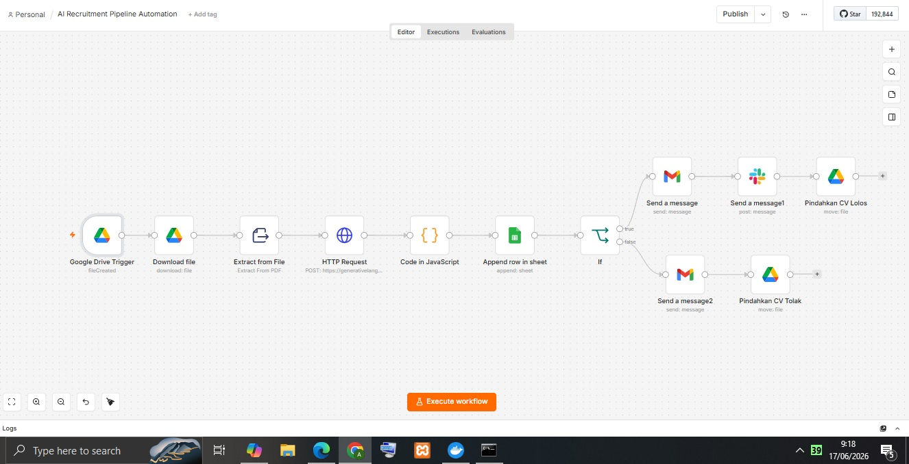
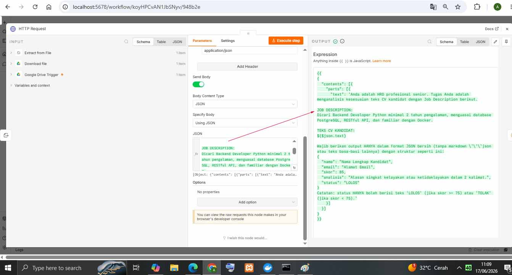
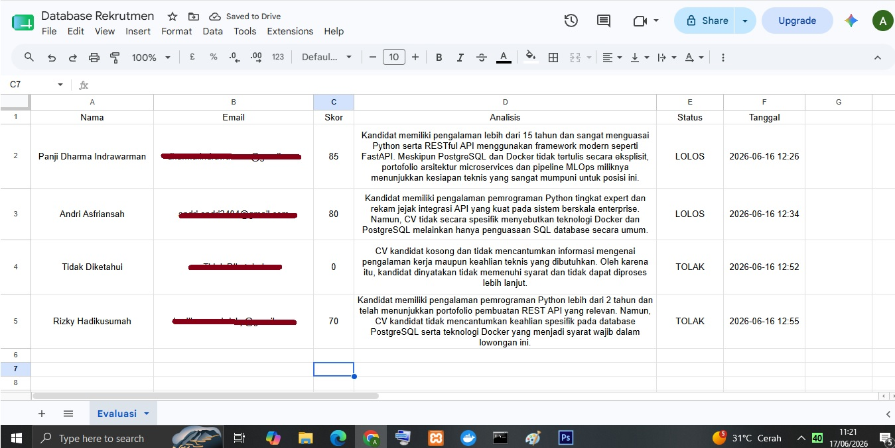
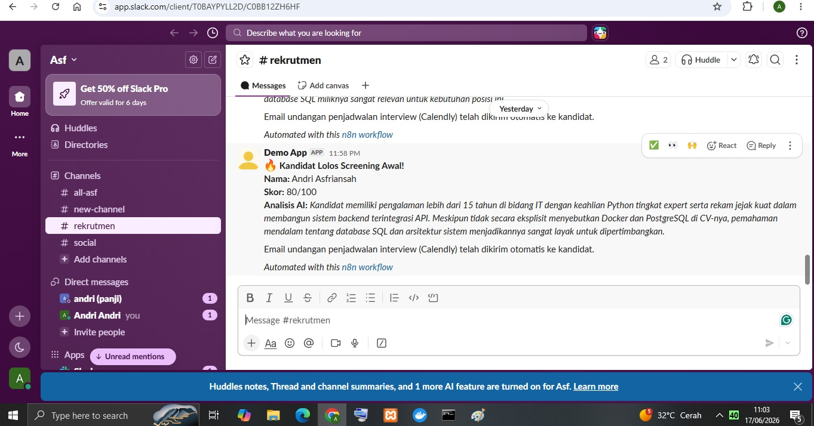
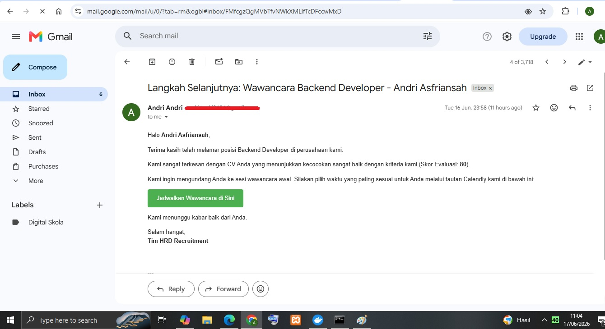

# 🚀 Automated AI Recruitment Pipeline (End-to-End Automation)

Sistem otomatisasi alur kerja rekrutmen nirserver (*serverless*) skala perusahaan (*enterprise-grade*) yang mengintegrasikan penyimpanan awan, dokumen PDF, Kecerdasan Buatan (AI), database dinamis, dan sistem komunikasi otomatis multi-saluran.

Sistem ini memotong waktu penyaringan (*screening*) CV awal dari rata-rata $15$ menit menjadi kurang dari **$30$ detik** per dokumen (Peningkatan kecepatan operasional hingga **$97\%+$**) secara mandiri $24/7$ di latar belakang tanpa bias kognitif.

---

## 📊 Business Impact & Key Metrics
*   **Efisiensi Waktu Ekstrem:** Memangkas beban kerja administrasi HRD sebesar **$90\%+$**.
*   **Operasional Mandiri:** Berjalan penuh $24/7$ secara otomatis tanpa pengawasan manual terus-menerus.
*   **Candidate Experience Premium:** Memastikan kebijakan *Zero Ghosting* dengan memberikan kepastian instan serta sistem penjadwalan mandiri (*self-service*) via Calendly bagi pelamar yang lolos.

---

## 🛠️ Arsitektur Sistem (Workflow Blueprint)

Berikut adalah visualisasi alur kerja lengkap yang dibangun di atas platform **n8n**:

### **Cara Kerja Sistem (Kiri ke Kanan):**
1.  **Ingestion:** n8n mendeteksi dokumen PDF baru di folder Google Drive secara berkala.
2.  **Extraction:** Mengekstrak data teks mentah dari file PDF pelamar.
3.  **AI Evaluation (Gemini 3.5 Flash API):** Menganalisis kesesuaian keahlian kandidat terhadap kriteria lowongan menggunakan teknik *Prompt Engineering* yang ketat dan memaksa keluaran dalam bentuk format JSON bersih.
4.  **Sanitization (JavaScript):** Membersihkan string teks dari karakter aneh dan baris baru (`\n`) menggunakan penanganan eror `try-catch` sehingga menghasilkan JSON yang $100\%$ valid.
5.  **Logging:** Mencatat data pelamar (Nama, Email, Skor, Analisis, Status, Timestamp) ke Google Sheets secara *real-time*.
6.  **Decision Branching (IF Node):**
    *   🟢 **Lolos (Skor $\ge 75$):** Mengirim email undangan wawancara (Gmail HTML) terintegrasi Calendly + Mengirimkan ringkasan profil kandidat ke Slack tim internal.
    *   🔴 **Ditolak (Skor $< 75$):** Mengirim email penolakan otomatis yang ramah dan suportif.
7.  **Auto-Cleanup:** Memindahkan file CV yang selesai diproses ke folder arsip untuk menghemat kuota Google API dan mencegah pemrosesan data ganda.

---

## 📸 Bukti Integrasi & Implementasi Teknis

### 1. Rekayasa Prompt & Konfigurasi HTTP Request (Gemini API)
Mengirimkan parameter payload dinamis ke API Google Gemini secara aman menggunakan template literal JavaScript.

### 2. Logika Database Real-Time (Google Sheets)
Pencatatan database otomatis lengkap dengan penanganan kasus pengecualian (*edge-case*) apabila pelamar mengirimkan dokumen kosong atau rusak.

### 3. Komunikasi Interaktif & Otomatis (Gmail & Slack)
Menghasilkan email penulisan HTML dinamis untuk pelamar dan notifikasi instan terformat ke ruang obrolan internal tim HR.

---

## 🚀 Cara Menggunakan Workflow Ini di n8n Anda

Jika Anda ingin mereplikasi alur kerja ini di server n8n Anda sendiri:
1.  Unduh file `workflow.json` dari repositori ini.
2.  Buka aplikasi n8n Anda, buat alur kerja baru.
3.  Klik ikon titik tiga di kanan atas, pilih **Import from file** lalu pilih file `workflow.json` yang telah diunduh.
4.  Sesuaikan kredensial API Google Sheets, Google Drive, Gmail, Slack, dan Google AI Studio Anda.
5.  Klik **Publish** untuk mengaktifkan!

---
*Proyek ini dirancang dan diimplementasikan secara mandiri sebagai bentuk penerapan keahlian di bidang Integration & Backend Automation Engineering.*
